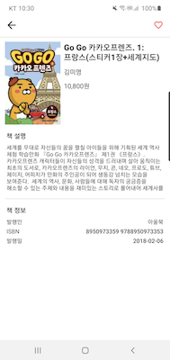

MyBooks
=======
Book search app using Daum search API 

Introduction
============
* A simple book search app implemented using the Android MVVM architecture.
* It has a book search list screen and a detailed book information screen.
* Supports dark theme.

Screenshots
===========

")
")

Libraries
=========
* [AppCompat][1] - Degrade gracefully on older versions of Android.
* [Data Binding][2] - Declaratively bind observable data to UI elements.
* [LiveData][3] - Build data objects that notify views when the underlying database changes.
* [Glide][4] for image loading
* [Koin][5]: for dependency injection
* [Kotlin Coroutines][6] for managing background threads with simplified code and reducing needs for callbacks
* [Retrofit][7] for REST api communication
* [OkHttp][8] Http client for Android

[1]: https://developer.android.com/topic/libraries/support-library/packages#v7-appcompat
[2]: https://developer.android.com/topic/libraries/data-binding/
[3]: https://developer.android.com/topic/libraries/architecture/livedata
[4]: https://bumptech.github.io/glide/
[5]: https://kotlinlang.org/docs/reference/coroutines-overview.html
[6]: https://insert-koin.io/
[7]: https://square.github.io/retrofit/
[8]: https://square.github.io/okhttp/
